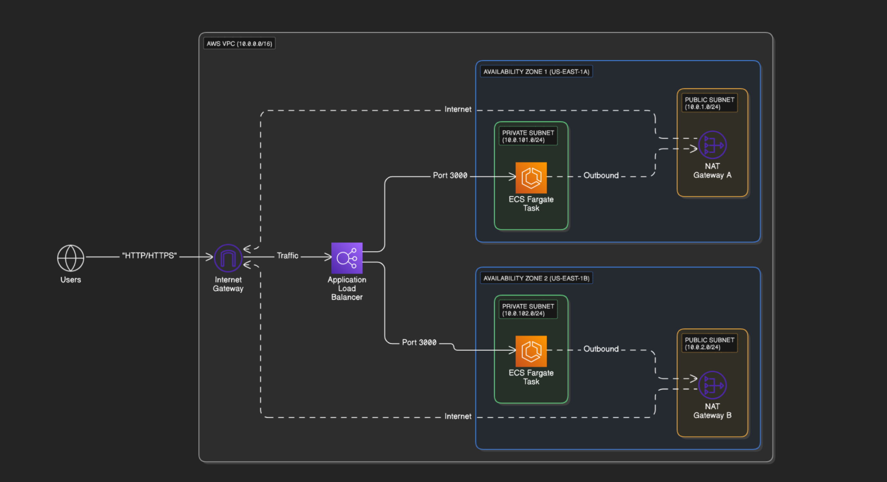
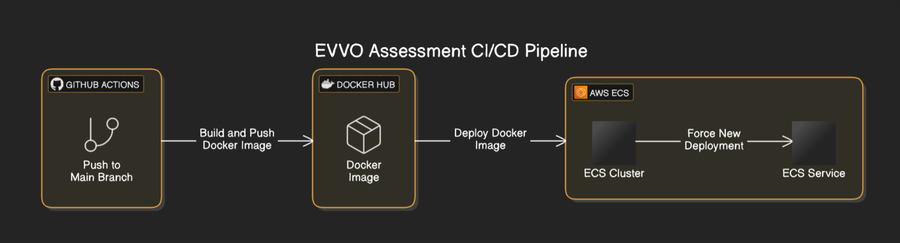

# EVVO Technology Assessment – Timeoff Management Application

## Overview

This repository automates the deployment of the **Timeoff Management Application** using **Terraform**, **Docker**, and **GitHub Actions** on **AWS ECS**. The solution is designed for a containerized, scalable cloud-based application, leveraging CI/CD to ensure continuous delivery and deployment.

## Components

- **Infrastructure (Terraform)**: Provision AWS resources like VPC, ECS, Load Balancer, and more, using Terraform.
- **Application (Docker)**: The app is containerized using Docker and deployed on ECS Fargate.
- **CI/CD (GitHub Actions)**: Automatically builds Docker images, pushes to **Docker Hub**, and deploys on ECS.

---

## Prerequisites

- **Terraform** for infrastructure management.
- **AWS Account** with appropriate permissions.
- **Docker** for building and pushing container images.
- **Git** for version control.

---

## Architecture Overview

Below are the architecture diagrams for both infrastructure and CI/CD:

### Infrastructure Architecture




---

## Terraform Infrastructure

The **Terraform** configuration manages AWS resources such as VPC, subnets, security groups, ECS services, and more. It ensures the application runs securely and efficiently.

### Terraform Configuration (`infra/main.tf`)

```terraform
terraform {
  required_version = ">= 1.0"
  required_providers {
    aws = {
      source  = "hashicorp/aws"
    version = "~> 5.0"
    }
    tls = {
      source  = "hashicorp/tls"
      version = ">= 3.0"
    }
  }
}

provider "aws" {
  region = "us-east-1"
}

###############################
# Networking Resources
###############################

resource "aws_vpc" "main" {
  cidr_block           = "10.0.0.0/16"
  enable_dns_support   = true
  enable_dns_hostnames = true
  tags = { Name = "main-vpc" }
}

resource "aws_internet_gateway" "igw" {
  vpc_id = aws_vpc.main.id
  tags   = { Name = "main-igw" }
}

# Public subnets (for the ALB)
resource "aws_subnet" "public_a" {
  vpc_id                  = aws_vpc.main.id
  cidr_block              = "10.0.1.0/24"
  availability_zone       = "us-east-1a"
  map_public_ip_on_launch = true
  tags = { Name = "public-subnet-a" }
}

resource "aws_subnet" "public_b" {
  vpc_id                  = aws_vpc.main.id
  cidr_block              = "10.0.2.0/24"
  availability_zone       = "us-east-1b"
  map_public_ip_on_launch = true
  tags = { Name = "public-subnet-b" }
}

resource "aws_route_table" "public" {
  vpc_id = aws_vpc.main.id

  route {
    cidr_block = "0.0.0.0/0"
    gateway_id = aws_internet_gateway.igw.id
  }

  tags = { Name = "public-rt" }
}

resource "aws_route_table_association" "public_a" {
  subnet_id      = aws_subnet.public_a.id
  route_table_id = aws_route_table.public.id
}

resource "aws_route_table_association" "public_b" {
  subnet_id      = aws_subnet.public_b.id
  route_table_id = aws_route_table.public.id
}

# Private subnets (for ECS tasks)
resource "aws_subnet" "private_a" {
  vpc_id            = aws_vpc.main.id
  cidr_block        = "10.0.101.0/24"
  availability_zone = "us-east-1a"
  tags = { Name = "private-subnet-a" }
}

resource "aws_subnet" "private_b" {
  vpc_id            = aws_vpc.main.id
  cidr_block        = "10.0.102.0/24"
  availability_zone = "us-east-1b"
  tags = { Name = "private-subnet-b" }
}

# NAT Gateways and Elastic IPs
resource "aws_eip" "nat_eip_a" {
  domain = "vpc"
}

resource "aws_nat_gateway" "nat_a" {
  allocation_id = aws_eip.nat_eip_a.id
  subnet_id     = aws_subnet.public_a.id
  tags = { Name = "nat-gateway-a" }
}

resource "aws_eip" "nat_eip_b" {
  domain = "vpc"
}

resource "aws_nat_gateway" "nat_b" {
  allocation_id = aws_eip.nat_eip_b.id
  subnet_id     = aws_subnet.public_b.id
  tags = { Name = "nat-gateway-b" }
}

resource "aws_route_table" "private_a" {
  vpc_id = aws_vpc.main.id

  route {
    cidr_block     = "0.0.0.0/0"
    nat_gateway_id = aws_nat_gateway.nat_a.id
  }

  tags = { Name = "private-rt-a" }
}

resource "aws_route_table_association" "private_a" {
  subnet_id      = aws_subnet.private_a.id
  route_table_id = aws_route_table.private_a.id
}

resource "aws_route_table" "private_b" {
  vpc_id = aws_vpc.main.id

  route {
    cidr_block     = "0.0.0.0/0"
    nat_gateway_id = aws_nat_gateway.nat_b.id
  }

  tags = { Name = "private-rt-b" }
}

resource "aws_route_table_association" "private_b" {
  subnet_id      = aws_subnet.private_b.id
  route_table_id = aws_route_table.private_b.id
}

###############################
# Security Groups
###############################

# ALB security group (allow HTTP and HTTPS)
resource "aws_security_group" "alb_sg" {
  name        = "alb-sg"
  description = "Security group for ALB"
  vpc_id      = aws_vpc.main.id

 ingress {
    description = "Allow HTTP"
    from_port   = 80
    to_port     = 80
    protocol    = "tcp"
    cidr_blocks = ["0.0.0.0/0"]
  }

  ingress {
    description = "Allow HTTPS"
    from_port   = 443
    to_port     = 443
    protocol    = "tcp"
    cidr_blocks = ["0.0.0.0/0"]
  }
  egress {
    description = "Allow all outbound"
    from_port   = 0
    to_port     = 0
    protocol    = "-1"
    cidr_blocks = ["0.0.0.0/0"]
  }

  tags = { Name = "alb-sg" }
}

# ECS tasks security group (allow inbound traffic from ALB)
resource "aws_security_group" "ecs_sg" {
  name        = "ecs-sg"
  description = "Security group for ECS tasks"
  vpc_id      = aws_vpc.main.id

  ingress {
    description     = "Allow traffic from ALB"
    from_port       = 3000
    to_port         = 3000
    protocol        = "tcp"
    security_groups = [aws_security_group.alb_sg.id]
  }

  egress {
    description = "Allow all outbound"
    from_port   = 0
    to_port     = 0
    protocol    = "-1"
    cidr_blocks = ["0.0.0.0/0"]
  }

  tags = { Name = "ecs-sg" }
}

###############################
# Application Load Balancer (ALB)
###############################

resource "aws_lb" "app_alb" {
  name               = "app-alb"
  internal           = false
  load_balancer_type = "application"
  security_groups    = [aws_security_group.alb_sg.id]
  subnets            = [aws_subnet.public_a.id, aws_subnet.public_b.id]
  tags = { Name = "app-alb" }
}

# Target Group for the ECS service (Fargate requires target_type = "ip")
resource "aws_lb_target_group" "app_tg" {
  name        = "app-tg"
  port        = 3000  # Exposed container port
  protocol    = "HTTP"
  target_type = "ip"
  vpc_id      = aws_vpc.main.id

  health_check {
    path                = "/"
    protocol            = "HTTP"
    matcher             = "200-399"
    healthy_threshold   = 3
    unhealthy_threshold = 3
    timeout             = 5
    interval            = 30
  }

  tags = { Name = "app-tg" }
}

###############################
# TLS/SSL Certificate (Self-Signed)
###############################

resource "tls_private_key" "alb_key" {
  algorithm = "RSA"
  rsa_bits  = 2048
}

resource "tls_self_signed_cert" "alb_cert" {
  private_key_pem = tls_private_key.alb_key.private_key_pem

  subject {
    common_name  = "evvo.ezero.in"
    organization = "Demo Org"
  }

  validity_period_hours = 8760  # 1 year
  early_renewal_hours   = 168
  is_ca_certificate     = false

  allowed_uses = [
    "key_encipherment",
    "digital_signature",
    "server_auth",
  ]
}

resource "aws_acm_certificate" "imported_cert" {
  certificate_body = tls_self_signed_cert.alb_cert.cert_pem
  private_key      = tls_private_key.alb_key.private_key_pem
}

###############################
# ALB Listeners (HTTP and HTTPS)
###############################

# HTTP listener on port 80 that redirects all traffic to HTTPS
resource "aws_lb_listener" "http_listener" {
  load_balancer_arn = aws_lb.app_alb.arn
  port              = "80"
  protocol          = "HTTP"

  default_action {
    type = "redirect"
    redirect {
      protocol    = "HTTPS"
      port        = "443"
      status_code = "HTTP_301"
    }
  }
}


# HTTPS listener on port 443 that terminates TLS using the ACM certificate
resource "aws_lb_listener" "https_listener" {
  load_balancer_arn = aws_lb.app_alb.arn
  port              = "443"
  protocol          = "HTTPS"
  ssl_policy        = "ELBSecurityPolicy-2016-08"
  certificate_arn   = aws_acm_certificate.imported_cert.arn

  default_action {
    type             = "forward"
    target_group_arn = aws_lb_target_group.app_tg.arn
  }
}

###############################
# ECS Cluster, Task Definition & Service
###############################

resource "aws_ecs_cluster" "cluster" {
  name = "evvo-cluster"
}

resource "aws_ecs_task_definition" "evvo" {
  family                   = "evvo-task"
  network_mode             = "awsvpc"
  requires_compatibilities = ["FARGATE"]
  cpu                      = "512"
  memory                   = "1024"

  container_definitions = jsonencode([{
    name  = "evvo"
    image = "syedimran18/timeoff-management:latest"
    portMappings = [
      {
        containerPort = 3000  # Exposing container port 3000
        hostPort      = 3000  # Host port must match container port for awsvpc
        protocol      = "tcp"
      }
    ]
  }])
}

resource "aws_ecs_service" "service" {
  name            = "evvo-service"
  cluster         = aws_ecs_cluster.cluster.id
  task_definition = aws_ecs_task_definition.evvo.arn
  launch_type     = "FARGATE"
  desired_count   = 2

  network_configuration {
    subnets         = [aws_subnet.private_a.id, aws_subnet.private_b.id]
    security_groups = [aws_security_group.ecs_sg.id]
    assign_public_ip = false
  }

  load_balancer {
    target_group_arn = aws_lb_target_group.app_tg.arn
    container_name   = "evvo"
    container_port   = 3000  # Exposing port 3000
  }

  deployment_minimum_healthy_percent = 100
  deployment_maximum_percent         = 200

  depends_on = [
    aws_lb_listener.https_listener
  ]
}

###############################
# Outputs
###############################

output "alb_dns_name" {
  value       = aws_lb.app_alb.dns_name
  description = "Access your application via HTTPS at this DNS name (browser warnings are expected due to the self-signed certificate)."
}

```

---

## Dockerfile

This Dockerfile builds a lightweight container for the application using **Node.js Alpine**.

### Dockerfile (`Dockerfile`)

```dockerfile
# Use Node.js with Alpine for dependencies (more stable than alpine:latest)
FROM node:16-alpine AS dependencies

RUN apk add --no-cache python3 make g++

WORKDIR /app

COPY package.json ./

RUN rm -rf node_modules

RUN npm install --production

COPY . .

# Create final runtime container
FROM node:16-alpine

# Labels for metadata
LABEL org.label-schema.schema-version="1.0"
LABEL org.label-schema.docker.cmd="docker run -d -p 3000:3000 --name alpine_timeoff"

WORKDIR /app

RUN adduser --system app --home /app
USER app

# Copy application files
COPY --from=dependencies /app /app

EXPOSE 3000

CMD ["npm", "start"]

```

---

## CI/CD Pipeline (GitHub Actions)

The **GitHub Actions** pipeline automates the process of building the Docker image, pushing it to **Docker Hub**, and deploying it to ECS.

### GitHub Actions Workflow (`.github/workflows/deploy.yaml`)

```yaml
name: EVVO assessment CI/CD Pipeline

on:
  push:
    branches:
      - main

jobs:
#   infra:
#     name: Deploy Infrastructure
#     runs-on: ubuntu-latest
#     steps:
#       - name: Checkout code
#         uses: actions/checkout@v4

#       - name: Filter Infra Changes
#         id: filter
#         uses: dorny/paths-filter@v2
#         with:
#           filters: |
#             infra:
#               - 'infra/**'

#       - name: Deploy Terraform Infrastructure
#         if: steps.filter.outputs.infra == 'true'
#         working-directory: infra
#         run: |
#           terraform init
#           terraform apply -auto-approve

#       - name: No Infra Changes Detected
#         if: steps.filter.outputs.infra != 'true'
#         run: echo "No changes in infra folder; skipping Terraform apply."

  build-and-deploy:
    name: Build and Deploy Docker Image
    # needs: infra   # This makes build-and-deploy wait for infra to finish.
    runs-on: ubuntu-latest
    env:
      AWS_REGION: us-east-1
      ECS_CLUSTER: evvo-cluster
      ECS_SERVICE: evvo-service
    #   DOCKER_IMAGE: your-dockerhub-username/your-app-name  # Replace with your actual Docker repo
    steps:
      - name: Checkout code
        uses: actions/checkout@v4

      - name: Log in to Docker Hub
        run: echo "${{ secrets.DOCKER_PASSWORD }}" | docker login -u "${{ secrets.DOCKER_USERNAME }}" --password-stdin

      - name: Build and Tag Docker Image
        run: |
          docker build -t timeoff .
          docker tag timeoff syedimran18/timeoff-management:latest

      - name: Push Docker Image to Docker Hub
        run: |
          docker push syedimran18/timeoff-management:latest

      - name: Configure AWS CLI
        run: |
          aws configure set aws_access_key_id "${{ secrets.AWS_ACCESS_KEY_ID }}"
          aws configure set aws_secret_access_key "${{ secrets.AWS_SECRET_ACCESS_KEY }}"
          aws configure set region $AWS_REGION

      - name: Force ECS Deployment
        run: |
          aws ecs update-service \
            --cluster $ECS_CLUSTER \
            --service $ECS_SERVICE \
            --force-new-deployment \
            --region $AWS_REGION

  # Optional: You can add further jobs if needed

```
### CI/CD Architecture


---

## Docker Hub Repository

The Docker images are stored in the following **Docker Hub** repository:

```
https://hub.docker.com/repository/docker/syedimran18/timeoff-management/general
```

---

## Deployment Process

The **GitHub Actions CI/CD pipeline** is set up to handle automatic deployments and updates:

-   **Infrastructure Changes**: The deployment process only runs when changes are made to the infrastructure (e.g., Terraform configuration). If no infrastructure changes are detected, no deployment happens.
-   **Build & Deploy**: Any changes to the `main` branch (in our case, **main**) trigger the **Build and Deploy** stage. The pipeline automatically builds the latest Docker image, pushes it to Docker Hub, and deploys it to **AWS Fargate**.

Additionally, I have chosen to use a **personal domain name** **evvo.ezero.in** for this project, which is not part of the deliverables but adds an extra layer of customization to the setup.


-   Feel free to reach out if you have any questions or need additional information.

```

complete walkthrough of the setup and deployment. Technical Challenge Completion Acknowledgment.pdf

```